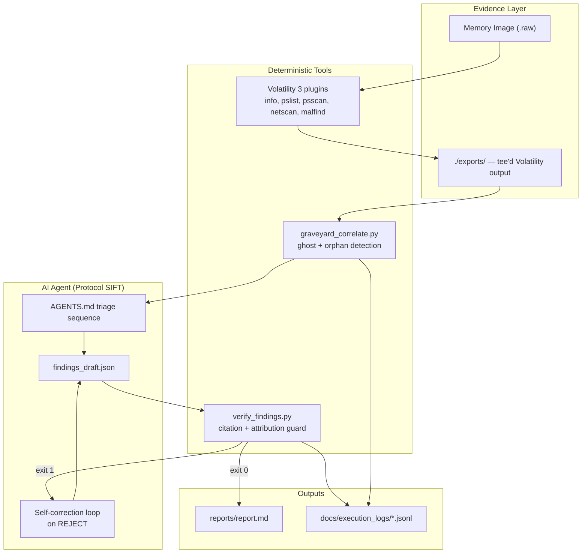
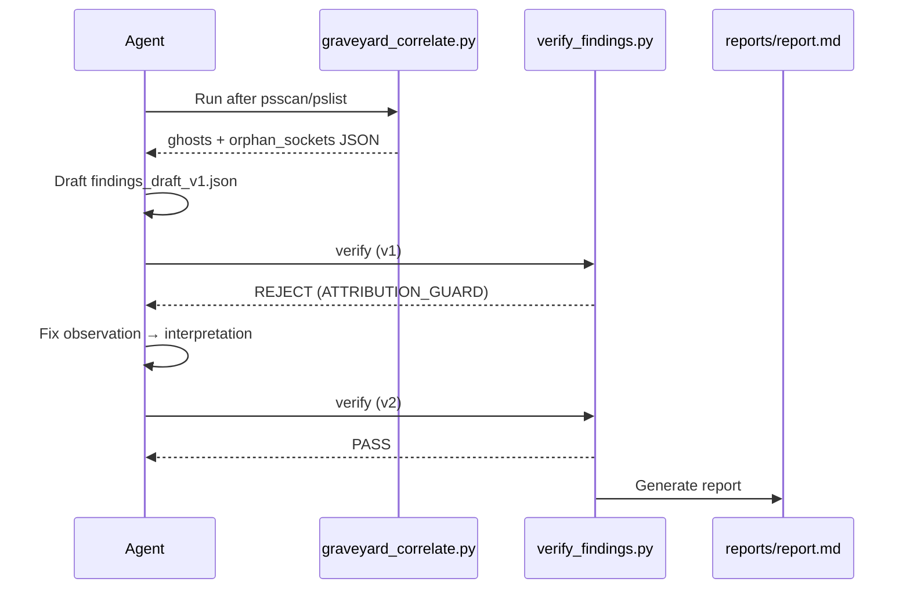

# GRAVEYARD Architecture

GRAVEYARD layers deterministic ghost detection and citation verification on top of Protocol SIFT's agent-driven memory triage.

## System diagram

## Component responsibilities

| Component | Type | Role |
|-----------|------|------|
| `AGENTS.md` | **Prompt guardrail** | Mandates triage order, observation/interpretation split, tee rules |
| `.cursor/rules/graveyard.mdc` | **Prompt guardrail** | Hard rules: ghost-first, no attribution in observations, self-correction |
| `graveyard_correlate.py` | **Architectural guardrail** | Deterministic PID diff + orphan socket detection — no LLM |
| `verify_findings.py` | **Architectural guardrail** | Schema, citation substring match, attribution guard, phantom artifact check |
| `schema/finding.schema.json` | **Architectural guardrail** | Structured finding contract |
| Protocol SIFT | Agent framework | Volatility command orchestration on SIFT |

## Prompt vs architectural guardrails

### Prompt guardrails (soft — guide agent behavior)

- `AGENTS.md` — triage sequence, finding format examples, self-correction instructions
- `.cursor/rules/graveyard.mdc` — always-on Cursor rules for export teeing and ghost-first analysis

These reduce errors but can be ignored by a misbehaving agent.

### Architectural guardrails (hard — enforce correctness)

- **`graveyard_correlate.py`** — parses exports programmatically; ghost/orphan results are reproducible
- **`verify_findings.py`** — exit code 1 blocks report generation; checks:
  - `ATTRIBUTION_GUARD` — no "malicious", "C2", "attacker" in observations
  - `CITATION_MISMATCH` — matched_text must exist verbatim in export
  - `PHANTOM_ARTIFACT` — PIDs/IPs/paths in observation must appear in exports
  - `CONFIDENCE_GUARD` — "confirmed" requires 2+ independent citations
- **Report gate** — `reports/report.md` only written on exit 0

## Self-correction flow

## Data flow

1. Volatility output → `exports/*.txt` (immutable tool artifacts)
2. Correlator reads exports → `analysis/graveyard_report.json` or stdout
3. Agent drafts `findings_draft.json` citing exact export substrings
4. Verifier validates against exports → report or rejection
5. All steps logged to `docs/execution_logs/*.jsonl`

## Design decisions

- **Ghost-first netscan**: Only investigate network on PIDs flagged by correlate — reduces noise and token waste
- **Substring citations**: Simple, auditable, no fuzzy matching — judges can grep exports
- **Exit code contract**: Agent loop uses shell exit codes; no custom API needed
- **Offline demo**: Sample exports let judges verify without a SIFT VM
