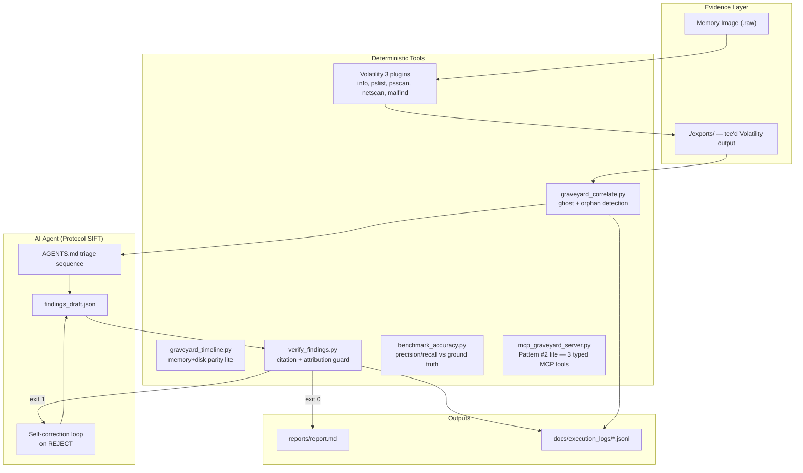
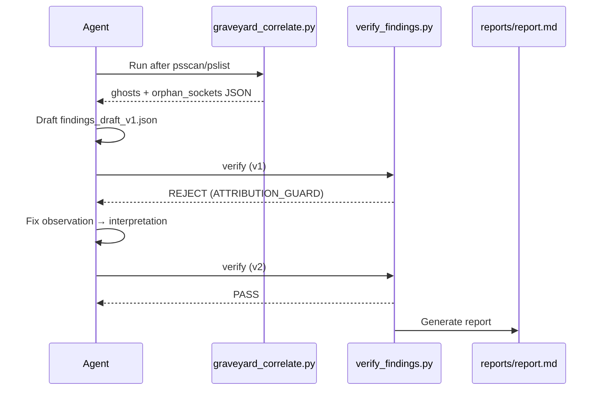
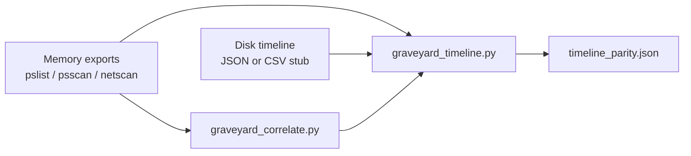

# GRAVEYARD Architecture

GRAVEYARD layers deterministic ghost detection and citation verification on top of Protocol SIFT's agent-driven memory triage.

## System diagram

## Component responsibilities

| Component | Type | Role |
|-----------|------|------|
| `AGENTS.md` | **Prompt guardrail** | Mandates triage order, observation/interpretation split, tee rules |
| `.cursor/rules/graveyard.mdc` | **Prompt guardrail** | Hard rules: ghost-first, no attribution in observations, self-correction |
| `graveyard_correlate.py` | **Architectural guardrail** | Deterministic PID diff + orphan socket detection — no LLM |
| `graveyard_timeline.py` | **Architectural guardrail** | Memory ghost vs disk timeline parity (JSON/CSV prefetch/bodyfile stub) |
| `verify_findings.py` | **Architectural guardrail** | Schema, citation substring match, attribution guard, phantom artifact check |
| `scripts/benchmark_accuracy.py` | **Metrics** | Precision/recall/F1 vs `examples/ground_truth_srl2018_sample.json` |
| `spoliation_guard.py` + `tests/test_spoliation.py` | **Constraint tests** | Evidence path blocking, hallucination guard, write-root policy |
| `schema/finding.schema.json` | **Architectural guardrail** | Structured finding contract |
| Protocol SIFT | Agent framework | Volatility command orchestration on SIFT |
| `mcp_graveyard_server.py` | **Architectural guardrail (MCP)** | Stdio MCP: correlate, verify, benchmark — read-only, no shell |
| `scripts/run_live_triage.sh` | Live pipeline | Full SIFT triage: vol → correlate → netscan → malfind → audit log |
| `run_demo.ps1` / `run_demo.sh` | Demo harness | One-command correlate → v1 REJECT → v2 PASS → report |

## Prompt vs architectural guardrails

### Prompt guardrails (soft — guide agent behavior)

- `AGENTS.md` — triage sequence, finding format examples, self-correction instructions
- `.cursor/rules/graveyard.mdc` — always-on Cursor rules for export teeing and ghost-first analysis

These reduce errors but can be ignored by a misbehaving agent.

### Architectural guardrails (hard — enforce correctness)

- **`graveyard_correlate.py`** — parses exports programmatically; ghost/orphan results are reproducible
- **`verify_findings.py`** — exit code 1 blocks report generation; checks:
  - `ATTRIBUTION_GUARD` — no "malicious", "C2", "attacker" in observations
  - `CITATION_MISMATCH` — matched_text must exist verbatim in export
  - `PHANTOM_ARTIFACT` — PIDs/IPs/paths in observation must appear in exports
  - `CONFIDENCE_GUARD` — "confirmed" requires 2+ independent citations
- **Report gate** — `reports/report.md` only written on exit 0

## Self-correction flow

## Data flow

1. Volatility output → `exports/*.txt` (immutable tool artifacts)
2. Correlator reads exports → `analysis/graveyard_report.json` or stdout
3. Agent drafts `findings_draft.json` citing exact export substrings
4. Verifier validates against exports → report or rejection
5. All steps logged to `docs/execution_logs/*.jsonl` via `scripts/generate_audit_log.py`

## Multi-source correlation layer

GRAVEYARD extends memory-only ghost detection with a lightweight **timeline parity** check when disk artifacts are available:

| Input | Format | Example |
|-------|--------|---------|
| Memory exports | Volatility tee files | `exports/psscan_*.txt` |
| Disk timeline | JSON `{entries: [...]}` or CSV | `examples/disk_timeline_sample.json` |

**Parity logic:** For each memory ghost, check whether the process name appears in the disk timeline (prefetch/bodyfile export). Match → corroboration candidate; gap → memory-only artifact flagged for analyst review.

Enable in live triage: `export DISK_TIMELINE=/path/to/timeline.json` before `scripts/run_live_triage.sh`.

## Pattern #2 lite — MCP integration

GRAVEYARD implements FIND EVIL **Custom MCP Server** pattern: three typed tools, stdio transport, zero shell access.

| MCP tool | Input | Output | Side effects |
|----------|-------|--------|--------------|
| `graveyard_correlate` | `exports_dir` (path) | Ghost/orphan JSON | None (read-only) |
| `verify_findings` | `findings_path`, `exports_dir` | `{passed, errors[]}` | None (read-only) |
| `benchmark_accuracy` | `exports_dir`, `ground_truth_path`, optional `findings_path` | Precision/recall/F1 JSON | None (read-only) |

Start server: `python mcp_graveyard_server.py` (stdio). Add to Claude Desktop or Protocol SIFT MCP config with repo path as `cwd`.

Security boundary: the MCP server cannot invoke Volatility or modify evidence — it only reads existing export files and findings JSON. Volatility orchestration remains in the Protocol SIFT agent layer.

## Design decisions

- **Ghost-first netscan**: Only investigate network on PIDs flagged by correlate — reduces noise and token waste
- **Substring citations**: Simple, auditable, no fuzzy matching — judges can grep exports
- **Exit code contract**: Agent loop uses shell exit codes; MCP returns structured pass/fail JSON
- **Pattern #2 lite**: Three MCP tools — plugs into existing Protocol SIFT agents without platform rebuild
- **Live pipeline**: `scripts/run_live_triage.sh` for SIFT with audit log + findings template
- **Measured accuracy**: `scripts/benchmark_accuracy.py` outputs judge-ready JSON metrics
- **Offline demo**: `run_demo.ps1` / `run_demo.sh` with pauses for video recording; sample exports for judges without SIFT VM
